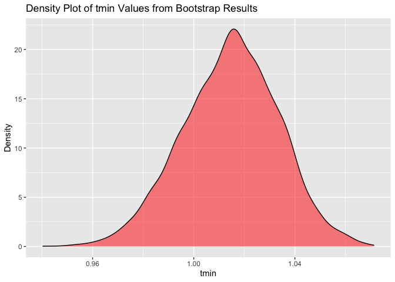
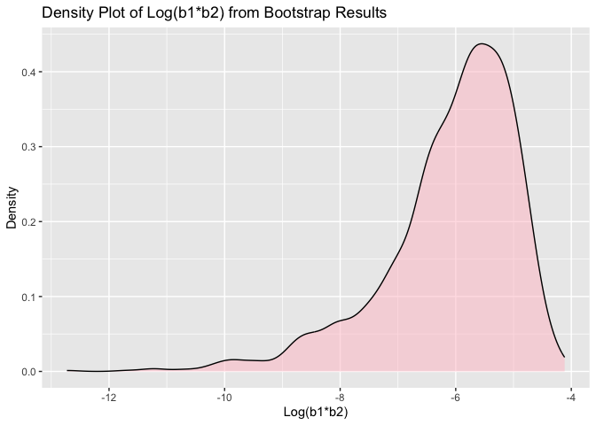

Homework6
================
Qianying Wu
2023-11-28

## Problem 1

In the data cleaning code below we create a `city_state` variable,
change `victim_age` to numeric, modifiy victim_race to have categories
white and non-white, with white as the reference category, and create a
`resolution` variable indicating whether the homicide is solved. Lastly,
we filtered out the following cities: Tulsa, AL; Dallas, TX; Phoenix,
AZ; and Kansas City, MO; and we retained only the variables
`city_state`, `resolution`, `victim_age`, `victim_sex`, and
`victim_race`.

``` r
homicide_df = 
  read_csv("data/homicide-data.csv", na = c("", "NA", "Unknown")) |> 
  mutate(
    city_state = str_c(city, state, sep = ", "),
    victim_age = as.numeric(victim_age),
    resolution = case_when(
      disposition == "Closed without arrest" ~ 0,
      disposition == "Open/No arrest"        ~ 0,
      disposition == "Closed by arrest"      ~ 1)
  ) |> 
  filter(victim_race %in% c("White", "Black")) |> 
  filter(!(city_state %in% c("Tulsa, AL", "Dallas, TX", "Phoenix, AZ", "Kansas City, MO"))) |> 
  select(city_state, resolution, victim_age, victim_sex, victim_race)
```

Next we fit a logistic regression model using only data from Baltimore,
MD. We model `resolved` as the outcome and `victim_age`, `victim_sex`,
and `victim_race` as predictors. We save the output as `baltimore_glm`
so that we can apply `broom::tidy` to this object and obtain the
estimate and confidence interval of the adjusted odds ratio for solving
homicides comparing non-white victims to white victims.

``` r
baltimore_glm = 
  filter(homicide_df, city_state == "Baltimore, MD") |> 
  glm(resolution ~ victim_age + victim_sex + victim_race, family = binomial(), data = _)

baltimore_glm |> 
  broom::tidy() |> 
  mutate(
    OR = exp(estimate), 
    OR_CI_upper = exp(estimate + 1.96 * std.error),
    OR_CI_lower = exp(estimate - 1.96 * std.error)) |> 
  filter(term == "victim_sexMale") |> 
  select(OR, OR_CI_lower, OR_CI_upper) |>
  knitr::kable(digits = 3)
```

|    OR | OR_CI_lower | OR_CI_upper |
|------:|------------:|------------:|
| 0.426 |       0.325 |       0.558 |

Below, by incorporating `nest()`, `map()`, and `unnest()` into the
preceding Baltimore-specific code, we fit a model for each of the
cities, and extract the adjusted odds ratio (and CI) for solving
homicides comparing non-white victims to white victims. We show the
first 5 rows of the resulting dataframe of model results.

``` r
model_results = 
  homicide_df |> 
  nest(data = -city_state) |> 
  mutate(
    models = map(data, \(df) glm(resolution ~ victim_age + victim_sex + victim_race, 
                             family = binomial(), data = df)),
    tidy_models = map(models, broom::tidy)) |> 
  select(-models, -data) |> 
  unnest(cols = tidy_models) |> 
  mutate(
    OR = exp(estimate), 
    OR_CI_upper = exp(estimate + 1.96 * std.error),
    OR_CI_lower = exp(estimate - 1.96 * std.error)) |> 
  filter(term == "victim_sexMale") |> 
  select(city_state, OR, OR_CI_lower, OR_CI_upper)

model_results |>
  slice(1:5) |> 
  knitr::kable(digits = 3)
```

| city_state      |    OR | OR_CI_lower | OR_CI_upper |
|:----------------|------:|------------:|------------:|
| Albuquerque, NM | 1.767 |       0.831 |       3.761 |
| Atlanta, GA     | 1.000 |       0.684 |       1.463 |
| Baltimore, MD   | 0.426 |       0.325 |       0.558 |
| Baton Rouge, LA | 0.381 |       0.209 |       0.695 |
| Birmingham, AL  | 0.870 |       0.574 |       1.318 |

Below we generate a plot of the estimated ORs and CIs for each city,
ordered by magnitude of the OR from smallest to largest. From this plot
we see that most cities have odds ratios that are smaller than 1,
suggesting that crimes with male victims have smaller odds of resolution
compared to crimes with female victims after adjusting for victim age
and race. This disparity is strongest in New yrok. In roughly half of
these cities, confidence intervals are narrow and do not contain 1,
suggesting a significant difference in resolution rates by sex after
adjustment for victim age and race.

``` r
model_results |> 
  mutate(city_state = fct_reorder(city_state, OR)) |> 
  ggplot(aes(x = city_state, y = OR)) + 
  geom_point() + 
  geom_errorbar(aes(ymin = OR_CI_lower, ymax = OR_CI_upper)) + 
  theme(axis.text.x = element_text(angle = 90, hjust = 1))
```

<!-- -->

## Problem 2

``` r
weather_df = 
  rnoaa::meteo_pull_monitors(
    c("USW00094728"),
    var = c("PRCP", "TMIN", "TMAX"), 
    date_min = "2022-01-01",
    date_max = "2022-12-31") |>
  mutate(
    name = recode(id, USW00094728 = "CentralPark_NY"),
    tmin = tmin / 10,
    tmax = tmax / 10) |>
  select(name, id, everything())
```

``` r
bootsample <- function(data) {
  sample_frac(data, replace = TRUE)
}

## Draw 5000 samples
boot_straps = tibble(strap_number = 1:5000) |>
  mutate(strap_sample = map(strap_number, \(i) bootsample(weather_df)))

## perform the bootstrap
bootstrap_results = boot_straps |> 
  mutate(models = map(strap_sample, \(df) lm(tmax ~ tmin + prcp, data = df)),
         results = map(models, broom::tidy),
         r_square = map_dbl(models, \(model) summary(model)$r.squared)) |>
  select(strap_number, r_square, results) |>
  unnest(results)
```

``` r
## Generate the result
results = bootstrap_results |>
  group_by(term) |>
  select(strap_number, term, estimate, r_square) |>
  pivot_wider(names_from = term, values_from = estimate) |>
  mutate (log_product = log(tmin * prcp)) 

results 
```

    ## # A tibble: 5,000 × 6
    ##    strap_number r_square `(Intercept)`  tmin      prcp log_product
    ##           <int>    <dbl>         <dbl> <dbl>     <dbl>       <dbl>
    ##  1            1    0.899          8.20 0.989  0.00732        -4.93
    ##  2            2    0.923          8.01 1.01   0.000531       -7.53
    ##  3            3    0.916          7.99 1.03  -0.00372       NaN   
    ##  4            4    0.926          7.79 1.02   0.00323        -5.71
    ##  5            5    0.922          7.87 1.02  -0.00254       NaN   
    ##  6            6    0.911          8.02 0.998  0.00462        -5.38
    ##  7            7    0.909          8.36 0.998 -0.00771       NaN   
    ##  8            8    0.936          8.02 1.03  -0.00654       NaN   
    ##  9            9    0.910          8.17 1.01  -0.00287       NaN   
    ## 10           10    0.922          7.95 1.01   0.00272        -5.90
    ## # ℹ 4,990 more rows

### Plots of the distributions

``` r
## Plot the result of rsquare
results |> ggplot(aes(x = r_square)) + 
  geom_density(fill = "blue", alpha = 0.5) +
  xlab ("R square") +
  ylab ("Density") + 
  ggtitle("Density Plot of R squared Values from Bootstrap Results")
```

<!-- -->

``` r
ggsave("Density Plot of R squared Values from Bootstrap Results.jpg")
  

## Plot the result of tmin
results |> ggplot(aes(x = tmin)) + 
  geom_density(fill = "red", alpha = 0.5) +
  xlab ("tmin") +
  ylab ("Density") + 
  ggtitle("Density Plot of tmin Values from Bootstrap Results")
```

<!-- -->

``` r
ggsave("Density Plot of tmin Values from Bootstrap Results.jpg")

## Plot the result of prcp
results |> ggplot(aes(x = prcp)) + 
  geom_density(fill = "green", alpha = 0.5) +
  xlab ("prcp") +
  ylab ("Density") + 
  ggtitle("Density Plot of prcp Values from Bootstrap Results")
```

<!-- -->

``` r
ggsave("Density Plot of prcp Values from Bootstrap Results.jpg")

## Plot the result of Log(b1*b2)
results |> ggplot(aes(x = log_product)) + 
  geom_density(fill = "pink", alpha = 0.5) +
  xlab ("Log(b1*b2)") +
  ylab ("Density") + 
  ggtitle("Density Plot of Log(b1*b2) from Bootstrap Results")
```

<!-- -->

``` r
ggsave("Density Plot of prcp Values from Bootstrap Results.jpg")
```

`Distribution of r square` is in the blue density plot. This
distribution is unimodal centered between 0.9 and 0.925. It is
approximately normal with symmetric tails.

`Distribution of tmin` is in the red density plot. It is also a unimodal
distribution. Its center is at approximately 1.02. This distribution is
approximately symmetric.

`Distribution of prcp` is in the green density plot. It is a bimodal
distribution with two peaks: one is approximately at -0.005, and the
other is approximately at 0.00. These two peaks are very close to each
other.

`Distribution of Log(beta1*beta2)` is in the pink density plot. It is a
left skewed distribution with a long tail on the left. The center of
this distribution is between -5 and -6.

### The percentage of NA values in Log(beta1\*beta2)

``` r
num_na_logprod <- sum(is.na(results$log_product))

total_observations <- nrow(results)

# Calculate the percentage of NA values
percentage_na_log_product <- (num_na_logprod / total_observations) 
percentage_na_log_product
```

    ## [1] 0.6742

The percentage of NA in the log(beta1\*beta2) is 0.672.

### Identify the Confidence Interval:

``` r
## Confidence interval for log(b1*b2)
results |>
  summarize(
    log_lower = quantile(log_product, 0.025, na.rm = TRUE),
    log_upper = quantile(log_product, 0.975, na.rm = TRUE)
  )
```

    ## # A tibble: 1 × 2
    ##   log_lower log_upper
    ##       <dbl>     <dbl>
    ## 1     -8.88     -4.58

``` r
# Confidence Interval for r_squared
results |> 
  summarize(
    r_squared_lower = quantile(r_square, 0.025, na.rm = TRUE),
    r_squared_upper = quantile(r_square, 0.975, na.rm = TRUE)
  )
```

    ## # A tibble: 1 × 2
    ##   r_squared_lower r_squared_upper
    ##             <dbl>           <dbl>
    ## 1           0.889           0.941

The 95% confidence interval for log(beta1\*beta2) is (-9.055, -4.536).
The 95% confidence interval for r square is (0.888, 0.940).

## Problem 3

### Load and clean data

``` r
data <- read_csv('data/birthweight.csv', na = c("", "NA", "Unknown"))
data <- data |>
  mutate(babysex = recode(babysex, "1" = "male", "2" = "female"),
         frace = recode(frace, "1" = "White", "2" = "Black", "3" = "Asian", 
                        "4" = "Puerto Rico", "8" = "Others", "9" = "Unknown"),
         malform = recode(malform, "0" = "absent", "1" = "present"),
         mrace = recode(mrace,"1" = "White", "2" = "Black", "3" = "Asian", 
                        "4" = "Puerto Rico", "8" = "Others")
         )
head(data)
```

    ## # A tibble: 6 × 20
    ##   babysex bhead blength   bwt delwt fincome frace gaweeks malform menarche
    ##   <chr>   <dbl>   <dbl> <dbl> <dbl>   <dbl> <chr>   <dbl> <chr>      <dbl>
    ## 1 female     34      51  3629   177      35 White    39.9 absent        13
    ## 2 male       34      48  3062   156      65 Black    25.9 absent        14
    ## 3 female     36      50  3345   148      85 White    39.9 absent        12
    ## 4 male       34      52  3062   157      55 White    40   absent        14
    ## 5 female     34      52  3374   156       5 White    41.6 absent        13
    ## 6 male       33      52  3374   129      55 White    40.7 absent        12
    ## # ℹ 10 more variables: mheight <dbl>, momage <dbl>, mrace <chr>, parity <dbl>,
    ## #   pnumlbw <dbl>, pnumsga <dbl>, ppbmi <dbl>, ppwt <dbl>, smoken <dbl>,
    ## #   wtgain <dbl>

Propose a regression model for birthweight. This model may be based on a
hypothesized structure for the factors that underly birthweight, on a
data-driven model-building process, or a combination of the two.
Describe your modeling process and show a plot of model residuals
against fitted values – use add_predictions and add_residuals in making
this plot.

``` r
model <- lm(bwt ~ babysex + blength + delwt + fincome + frace + gaweeks + malform + menarche + mheight + momage + mrace + parity + pnumlbw + pnumsga + ppbmi + ppwt + smoken + wtgain, data = data)

summary(model)
```

    ## 
    ## Call:
    ## lm(formula = bwt ~ babysex + blength + delwt + fincome + frace + 
    ##     gaweeks + malform + menarche + mheight + momage + mrace + 
    ##     parity + pnumlbw + pnumsga + ppbmi + ppwt + smoken + wtgain, 
    ##     data = data)
    ## 
    ## Residuals:
    ##     Min      1Q  Median      3Q     Max 
    ## -1654.4  -205.7    -6.7   198.6  3693.9 
    ## 
    ## Coefficients: (3 not defined because of singularities)
    ##                    Estimate Std. Error t value Pr(>|t|)    
    ## (Intercept)      -5224.3675   760.1179  -6.873 7.18e-12 ***
    ## babysexmale         20.3313     9.6545   2.106  0.03527 *  
    ## blength            115.1962     1.9850  58.032  < 2e-16 ***
    ## delwt                5.3504     0.4541  11.784  < 2e-16 ***
    ## fincome              0.5286     0.2071   2.553  0.01073 *  
    ## fraceBlack          -3.4188    90.9805  -0.038  0.97003    
    ## fraceOthers         50.6525   112.6099   0.450  0.65287    
    ## fracePuerto Rico   -60.5883    90.5582  -0.669  0.50350    
    ## fraceWhite          17.9172    79.9631   0.224  0.82271    
    ## gaweeks             22.8559     1.6557  13.805  < 2e-16 ***
    ## malformpresent      30.0408    81.5045   0.369  0.71246    
    ## menarche            -1.5596     3.3406  -0.467  0.64062    
    ## mheight             20.9248    11.8954   1.759  0.07864 .  
    ## momage               1.1697     1.4104   0.829  0.40697    
    ## mraceBlack         -96.4075    93.4186  -1.032  0.30213    
    ## mracePuerto Rico    53.6760    93.4175   0.575  0.56560    
    ## mraceWhite          51.7697    82.9903   0.624  0.53279    
    ## parity             124.2871    46.7075   2.661  0.00782 ** 
    ## pnumlbw                  NA         NA      NA       NA    
    ## pnumsga                  NA         NA      NA       NA    
    ## ppbmi               21.0744    17.1780   1.227  0.21995    
    ## ppwt                -6.9450     3.0127  -2.305  0.02120 *  
    ## smoken              -6.3579     0.6759  -9.406  < 2e-16 ***
    ## wtgain                   NA         NA      NA       NA    
    ## ---
    ## Signif. codes:  0 '***' 0.001 '**' 0.01 '*' 0.05 '.' 0.1 ' ' 1
    ## 
    ## Residual standard error: 314.5 on 4321 degrees of freedom
    ## Multiple R-squared:  0.6248, Adjusted R-squared:  0.623 
    ## F-statistic: 359.7 on 20 and 4321 DF,  p-value: < 2.2e-16

According to the model summary, we can see that a few factors are
significant with p value less than 0.05, such as smoken, parity, ppwt,
and gaweek. However, there are also a lot of variables that are non
significant with p value greater than 0.05, such as frace, malform,
menarche, mheight, momage, mrace, ppbmi. There are also some factors
producing NA values, such as wtgain, pnumlbw, and pnumsga.

Based on this result, we can drop some variables with NA values such as
wtgain, pnumlbw, and pnumsga and some variables that have large p values
to get our model.

``` r
model_ori <- lm(bwt ~ babysex + blength + delwt + fincome + gaweeks + mheight + parity + ppwt + smoken, data = data)


summary(model_ori)
```

    ## 
    ## Call:
    ## lm(formula = bwt ~ babysex + blength + delwt + fincome + gaweeks + 
    ##     mheight + parity + ppwt + smoken, data = data)
    ## 
    ## Residuals:
    ##     Min      1Q  Median      3Q     Max 
    ## -1612.0  -205.0   -10.3   198.3  3963.7 
    ## 
    ## Coefficients:
    ##               Estimate Std. Error t value Pr(>|t|)    
    ## (Intercept) -4724.0411   145.2280 -32.528  < 2e-16 ***
    ## babysexmale    20.0298     9.8797   2.027 0.042686 *  
    ## blength       120.1891     2.0041  59.971  < 2e-16 ***
    ## delwt           5.0184     0.4619  10.864  < 2e-16 ***
    ## fincome         1.6877     0.1918   8.800  < 2e-16 ***
    ## gaweeks        25.2978     1.6858  15.006  < 2e-16 ***
    ## mheight         7.3041     2.0710   3.527 0.000425 ***
    ## parity        135.6330    47.7291   2.842 0.004508 ** 
    ## ppwt           -3.2569     0.5052  -6.447 1.27e-10 ***
    ## smoken         -3.7540     0.6679  -5.620 2.02e-08 ***
    ## ---
    ## Signif. codes:  0 '***' 0.001 '**' 0.01 '*' 0.05 '.' 0.1 ' ' 1
    ## 
    ## Residual standard error: 322.4 on 4332 degrees of freedom
    ## Multiple R-squared:  0.6047, Adjusted R-squared:  0.6038 
    ## F-statistic: 736.2 on 9 and 4332 DF,  p-value: < 2.2e-16

``` r
data |>
  add_predictions(model_ori) |>
  add_residuals(model_ori) |>
  ggplot(aes(x = pred, y = resid)) +
  geom_point() +
  geom_hline(yintercept = 0, linetype = "dashed", color = "blue") +
  labs(x = "Fitted Values", y = "Residuals", title = "Residuals vs Fitted Plot for Birthweight Model")
```

<!-- --> After
optimizing the model based on the very rough model, we can see that all
variables are statistically significant in this new model with p values
less than 0.05. The very small p-value here suggests that the model is
statistically significant.

``` r
set.seed(123)
# Model 1: Length at birth and gestational age
model1 <- lm(bwt ~ blength + gaweeks, data = data)
summary(model1)
```

    ## 
    ## Call:
    ## lm(formula = bwt ~ blength + gaweeks, data = data)
    ## 
    ## Residuals:
    ##     Min      1Q  Median      3Q     Max 
    ## -1709.6  -215.4   -11.4   208.2  4188.8 
    ## 
    ## Coefficients:
    ##              Estimate Std. Error t value Pr(>|t|)    
    ## (Intercept) -4347.667     97.958  -44.38   <2e-16 ***
    ## blength       128.556      1.990   64.60   <2e-16 ***
    ## gaweeks        27.047      1.718   15.74   <2e-16 ***
    ## ---
    ## Signif. codes:  0 '***' 0.001 '**' 0.01 '*' 0.05 '.' 0.1 ' ' 1
    ## 
    ## Residual standard error: 333.2 on 4339 degrees of freedom
    ## Multiple R-squared:  0.5769, Adjusted R-squared:  0.5767 
    ## F-statistic:  2958 on 2 and 4339 DF,  p-value: < 2.2e-16

``` r
# Mqodel 2: Head circumference, length, sex, and all interactions
model2 <- lm(bwt ~ bhead + blength + babysex + bhead * blength + bhead * babysex + blength * babysex, data = data)
summary(model2)
```

    ## 
    ## Call:
    ## lm(formula = bwt ~ bhead + blength + babysex + bhead * blength + 
    ##     bhead * babysex + blength * babysex, data = data)
    ## 
    ## Residuals:
    ##     Min      1Q  Median      3Q     Max 
    ## -1133.8  -189.7    -7.2   178.8  2721.8 
    ## 
    ## Coefficients:
    ##                       Estimate Std. Error t value Pr(>|t|)    
    ## (Intercept)         -3508.3263   820.5298  -4.276 1.95e-05 ***
    ## bhead                  66.8435    25.4407   2.627  0.00863 ** 
    ## blength                35.7217    17.4013   2.053  0.04015 *  
    ## babysexmale          -259.9785   197.9105  -1.314  0.18904    
    ## bhead:blength           1.5608     0.5269   2.962  0.00307 ** 
    ## bhead:babysexmale      12.6620     7.0450   1.797  0.07236 .  
    ## blength:babysexmale    -4.2107     4.1691  -1.010  0.31257    
    ## ---
    ## Signif. codes:  0 '***' 0.001 '**' 0.01 '*' 0.05 '.' 0.1 ' ' 1
    ## 
    ## Residual standard error: 288.1 on 4335 degrees of freedom
    ## Multiple R-squared:  0.6839, Adjusted R-squared:  0.6835 
    ## F-statistic:  1563 on 6 and 4335 DF,  p-value: < 2.2e-16

``` r
# The original Model
cv_model <- crossv_mc(data, 100)
errors <- map2_dbl(cv_model$train, cv_model$test, ~{
  model1_fit <- lm(bwt ~ babysex + blength + delwt + fincome + frace + gaweeks + malform + menarche + mheight + momage + mrace + parity + pnumlbw + pnumsga + ppbmi + ppwt + smoken + wtgain, data = .x)
  rmse(model1_fit, .y)
})

mean(errors)
```

    ## [1] 313.6564

``` r
# model 1
cv_model <- crossv_mc(data, 100)
errors <- map2_dbl(cv_model$train, cv_model$test, ~{
  model1_fit <- lm(bwt ~ blength + gaweeks, data = .x)
  rmse(model1_fit, .y)
})

mean(errors)
```

    ## [1] 330.7784

``` r
# model 2
cv_model <- crossv_mc(data, 100)
errors <- map2_dbl(cv_model$train, cv_model$test, ~{
  model2_fit <- lm(bwt ~ bhead + blength + babysex + bhead * blength + bhead * babysex + blength * babysex, data = .x)
  rmse(model2_fit, .y)
})

mean(errors)
```

    ## [1] 290.3128

According to the cross validated prediction error, we see that the error
for our original model is 313.6564, the error for model1 is largest with
330.7, and the error for model2 is smallest with 290.3128. Therefore,
according to these data, we can say that the model using head
circumference, length, sex, and all interactions (including the
three-way interaction) is the best model with smallest error.
