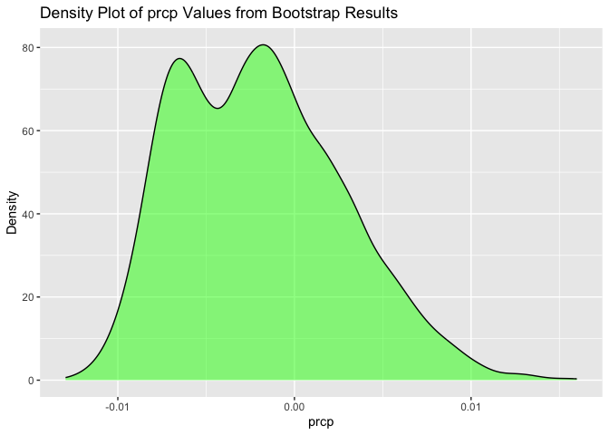

Homework6
================
Qianying Wu
2023-11-28

## Problem 1

In the data cleaning code below we create a `city_state` variable,
change `victim_age` to numeric, modifiy victim_race to have categories
white and non-white, with white as the reference category, and create a
`resolution` variable indicating whether the homicide is solved. Lastly,
we filtered out the following cities: Tulsa, AL; Dallas, TX; Phoenix,
AZ; and Kansas City, MO; and we retained only the variables
`city_state`, `resolution`, `victim_age`, `victim_sex`, and
`victim_race`.

``` r
homicide_df = 
  read_csv("data/homicide-data.csv", na = c("", "NA", "Unknown")) |> 
  mutate(
    city_state = str_c(city, state, sep = ", "),
    victim_age = as.numeric(victim_age),
    resolution = case_when(
      disposition == "Closed without arrest" ~ 0,
      disposition == "Open/No arrest"        ~ 0,
      disposition == "Closed by arrest"      ~ 1)
  ) |> 
  filter(victim_race %in% c("White", "Black")) |> 
  filter(!(city_state %in% c("Tulsa, AL", "Dallas, TX", "Phoenix, AZ", "Kansas City, MO"))) |> 
  select(city_state, resolution, victim_age, victim_sex, victim_race)
```

    ## Rows: 52179 Columns: 12
    ## ── Column specification ────────────────────────────────────────────────────────
    ## Delimiter: ","
    ## chr (8): uid, victim_last, victim_first, victim_race, victim_sex, city, stat...
    ## dbl (4): reported_date, victim_age, lat, lon
    ## 
    ## ℹ Use `spec()` to retrieve the full column specification for this data.
    ## ℹ Specify the column types or set `show_col_types = FALSE` to quiet this message.

Next we fit a logistic regression model using only data from Baltimore,
MD. We model `resolved` as the outcome and `victim_age`, `victim_sex`,
and `victim_race` as predictors. We save the output as `baltimore_glm`
so that we can apply `broom::tidy` to this object and obtain the
estimate and confidence interval of the adjusted odds ratio for solving
homicides comparing non-white victims to white victims.

``` r
baltimore_glm = 
  filter(homicide_df, city_state == "Baltimore, MD") |> 
  glm(resolution ~ victim_age + victim_sex + victim_race, family = binomial(), data = _)

baltimore_glm |> 
  broom::tidy() |> 
  mutate(
    OR = exp(estimate), 
    OR_CI_upper = exp(estimate + 1.96 * std.error),
    OR_CI_lower = exp(estimate - 1.96 * std.error)) |> 
  filter(term == "victim_sexMale") |> 
  select(OR, OR_CI_lower, OR_CI_upper) |>
  knitr::kable(digits = 3)
```

|    OR | OR_CI_lower | OR_CI_upper |
|------:|------------:|------------:|
| 0.426 |       0.325 |       0.558 |

Below, by incorporating `nest()`, `map()`, and `unnest()` into the
preceding Baltimore-specific code, we fit a model for each of the
cities, and extract the adjusted odds ratio (and CI) for solving
homicides comparing non-white victims to white victims. We show the
first 5 rows of the resulting dataframe of model results.

``` r
model_results = 
  homicide_df |> 
  nest(data = -city_state) |> 
  mutate(
    models = map(data, \(df) glm(resolution ~ victim_age + victim_sex + victim_race, 
                             family = binomial(), data = df)),
    tidy_models = map(models, broom::tidy)) |> 
  select(-models, -data) |> 
  unnest(cols = tidy_models) |> 
  mutate(
    OR = exp(estimate), 
    OR_CI_upper = exp(estimate + 1.96 * std.error),
    OR_CI_lower = exp(estimate - 1.96 * std.error)) |> 
  filter(term == "victim_sexMale") |> 
  select(city_state, OR, OR_CI_lower, OR_CI_upper)

model_results |>
  slice(1:5) |> 
  knitr::kable(digits = 3)
```

| city_state      |    OR | OR_CI_lower | OR_CI_upper |
|:----------------|------:|------------:|------------:|
| Albuquerque, NM | 1.767 |       0.831 |       3.761 |
| Atlanta, GA     | 1.000 |       0.684 |       1.463 |
| Baltimore, MD   | 0.426 |       0.325 |       0.558 |
| Baton Rouge, LA | 0.381 |       0.209 |       0.695 |
| Birmingham, AL  | 0.870 |       0.574 |       1.318 |

Below we generate a plot of the estimated ORs and CIs for each city,
ordered by magnitude of the OR from smallest to largest. From this plot
we see that most cities have odds ratios that are smaller than 1,
suggesting that crimes with male victims have smaller odds of resolution
compared to crimes with female victims after adjusting for victim age
and race. This disparity is strongest in New yrok. In roughly half of
these cities, confidence intervals are narrow and do not contain 1,
suggesting a significant difference in resolution rates by sex after
adjustment for victim age and race.

``` r
model_results |> 
  mutate(city_state = fct_reorder(city_state, OR)) |> 
  ggplot(aes(x = city_state, y = OR)) + 
  geom_point() + 
  geom_errorbar(aes(ymin = OR_CI_lower, ymax = OR_CI_upper)) + 
  theme(axis.text.x = element_text(angle = 90, hjust = 1))
```

<!-- -->

## Problem 2

``` r
weather_df = 
  rnoaa::meteo_pull_monitors(
    c("USW00094728"),
    var = c("PRCP", "TMIN", "TMAX"), 
    date_min = "2022-01-01",
    date_max = "2022-12-31") |>
  mutate(
    name = recode(id, USW00094728 = "CentralPark_NY"),
    tmin = tmin / 10,
    tmax = tmax / 10) |>
  select(name, id, everything())
```

    ## using cached file: /Users/BettyWu/Library/Caches/org.R-project.R/R/rnoaa/noaa_ghcnd/USW00094728.dly

    ## date created (size, mb): 2023-10-01 12:59:26.990129 (8.525)

    ## file min/max dates: 1869-01-01 / 2023-09-30

``` r
bootsample <- function(data) {
  sample_frac(data, replace = TRUE)
}

## Draw 5000 samples
boot_straps = tibble(strap_number = 1:5000) |>
  mutate(strap_sample = map(strap_number, \(i) bootsample(weather_df)))

## perform the bootstrap
bootstrap_results = boot_straps |> 
  mutate(models = map(strap_sample, \(df) lm(tmax ~ tmin + prcp, data = df)),
         results = map(models, broom::tidy),
         r_square = map_dbl(models, \(model) summary(model)$r.squared)) |>
  select(strap_number, r_square, results) |>
  unnest(results)
```

``` r
## Generate the result
results = bootstrap_results |>
  group_by(term) |>
  select(strap_number, term, estimate, r_square) |>
  pivot_wider(names_from = term, values_from = estimate) |>
  mutate (log_product = log(tmin * prcp)) 
```

    ## Warning: There was 1 warning in `mutate()`.
    ## ℹ In argument: `log_product = log(tmin * prcp)`.
    ## Caused by warning in `log()`:
    ## ! NaNs produced

``` r
results 
```

    ## # A tibble: 5,000 × 6
    ##    strap_number r_square `(Intercept)`  tmin       prcp log_product
    ##           <int>    <dbl>         <dbl> <dbl>      <dbl>       <dbl>
    ##  1            1    0.907          8.00 1.01   0.00379         -5.57
    ##  2            2    0.911          8.08 1.00  -0.000923       NaN   
    ##  3            3    0.927          8.14 1.00   0.000507        -7.58
    ##  4            4    0.936          8.30 1.02  -0.00513        NaN   
    ##  5            5    0.895          8.42 0.991 -0.000224       NaN   
    ##  6            6    0.917          8.01 1.02  -0.00807        NaN   
    ##  7            7    0.923          7.83 1.01   0.0000520       -9.85
    ##  8            8    0.915          7.80 1.02   0.00138         -6.57
    ##  9            9    0.944          7.78 1.04  -0.00437        NaN   
    ## 10           10    0.906          8.63 1.00  -0.00317        NaN   
    ## # ℹ 4,990 more rows

### Plots of the distributions

``` r
## Plot the result of rsquare
results |> ggplot(aes(x = r_square)) + 
  geom_density(fill = "blue", alpha = 0.5) +
  xlab ("R square") +
  ylab ("Density") + 
  ggtitle("Density Plot of R squared Values from Bootstrap Results")
```

<!-- -->

``` r
ggsave("Density Plot of R squared Values from Bootstrap Results.jpg")
```

    ## Saving 7 x 5 in image

``` r
## Plot the result of tmin
results |> ggplot(aes(x = tmin)) + 
  geom_density(fill = "red", alpha = 0.5) +
  xlab ("tmin") +
  ylab ("Density") + 
  ggtitle("Density Plot of tmin Values from Bootstrap Results")
```

<!-- -->

``` r
ggsave("Density Plot of tmin Values from Bootstrap Results.jpg")
```

    ## Saving 7 x 5 in image

``` r
## Plot the result of prcp
results |> ggplot(aes(x = prcp)) + 
  geom_density(fill = "green", alpha = 0.5) +
  xlab ("prcp") +
  ylab ("Density") + 
  ggtitle("Density Plot of prcp Values from Bootstrap Results")
```

<!-- -->

``` r
ggsave("Density Plot of prcp Values from Bootstrap Results.jpg")
```

    ## Saving 7 x 5 in image

``` r
## Plot the result of Log(b1*b2)
results |> ggplot(aes(x = log_product)) + 
  geom_density(fill = "pink", alpha = 0.5) +
  xlab ("Log(b1*b2)") +
  ylab ("Density") + 
  ggtitle("Density Plot of Log(b1*b2) from Bootstrap Results")
```

    ## Warning: Removed 3376 rows containing non-finite values (`stat_density()`).

<!-- -->

``` r
ggsave("Density Plot of prcp Values from Bootstrap Results.jpg")
```

    ## Saving 7 x 5 in image

    ## Warning: Removed 3376 rows containing non-finite values (`stat_density()`).

`Distribution of r square` is in the blue density plot. This
distribution is unimodal centered between 0.9 and 0.925. It is
approximately normal with symmetric tails.

`Distribution of tmin` is in the red density plot. It is also a unimodal
distribution. Its center is at approximately 1.02. This distribution is
approximately symmetric.

`Distribution of prcp` is in the green density plot. It is a bimodal
distribution with two peaks: one is approximately at -0.005, and the
other is approximately at 0.00. These two peaks are very close to each
other.

`Distribution of Log(beta1*beta2)` is in the pink density plot. It is a
left skewed distribution with a long tail on the left. The center of
this distribution is between -5 and -6.

### The percentage of NA values in Log(beta1\*beta2)

``` r
num_na_logprod <- sum(is.na(results$log_product))

total_observations <- nrow(results)

# Calculate the percentage of NA values
percentage_na_log_product <- (num_na_logprod / total_observations) 
percentage_na_log_product
```

    ## [1] 0.6752

The percentage of NA in the log(beta1\*beta2) is 0.672.

### Identify the Confidence Interval:

``` r
## Confidence interval for log(b1*b2)
results |>
  summarize(
    log_lower = quantile(log_product, 0.025, na.rm = TRUE),
    log_upper = quantile(log_product, 0.975, na.rm = TRUE)
  )
```

    ## # A tibble: 1 × 2
    ##   log_lower log_upper
    ##       <dbl>     <dbl>
    ## 1     -8.97     -4.55

``` r
# Confidence Interval for r_squared
results |> 
  summarize(
    r_squared_lower = quantile(r_square, 0.025, na.rm = TRUE),
    r_squared_upper = quantile(r_square, 0.975, na.rm = TRUE)
  )
```

    ## # A tibble: 1 × 2
    ##   r_squared_lower r_squared_upper
    ##             <dbl>           <dbl>
    ## 1           0.889           0.941

The 95% confidence interval for log(beta1\*beta2) is (-9.055, -4.536).
The 95% confidence interval for r square is (0.888, 0.940).

## Problem 3
